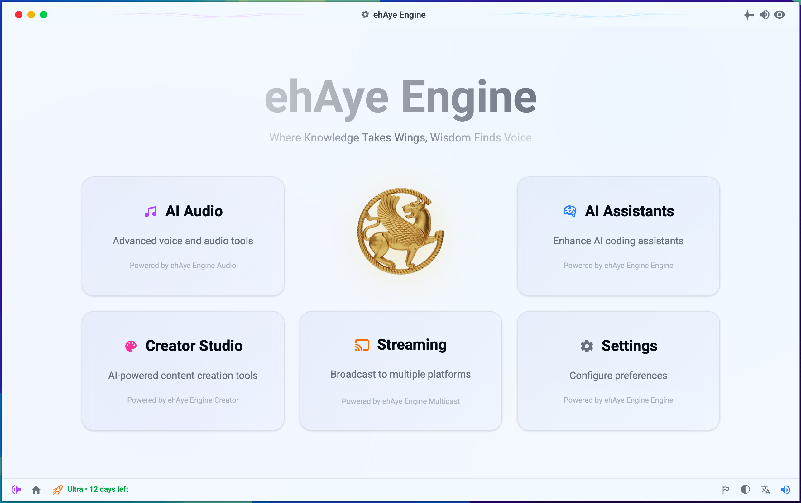

# ehAye™ Engine
### Where Knowledge Takes Wings, Wisdom Finds Voice

<picture>
  <source media="(prefers-color-scheme: dark)" srcset="images/ehaye-welcome-dark.png">
  <source media="(prefers-color-scheme: light)" srcset="images/ehaye-welcome-light.png">
  
</picture>

## Overview

**ehAye™ Engine** (pronounced "A.I.") gives your A.I. coding assistants a voice, vision, and control. It unifies sound, sight, and system intelligence into one modular platform, powering real-time interaction across audio, music, and creative tools—with privacy at its core.

What started as a voice engine for developers who wanted their A.I. to speak intelligently has evolved into a comprehensive modular system that brings together Audio, MCP (vision and control), Music, and Creator modules for full-spectrum A.I. expression.

## Why ehAye™ Engine?

> "I built ehAye™ Engine because I wanted my A.I. coding assistants to speak, not just reply on a screen, but sound alive. What began as a small developer tool quickly grew into something bigger, faster, smarter, and too good to keep private.
>
> ehAye™ Engine gives your A.I. coding assistants a voice, vision, and control. It runs locally, with your privacy in mind, and is built for developers who want a coding partner, not just a tool.
>
> A tool that became a platform, and my coding partner, simply because it needed to exist."
>
> — **Val Neekman**, CEO & Founder @ Neekware Inc.

## Modules

The dashboard showcases the complete ehAye™ Engine ecosystem:

- **🎵 AI Audio** - Advanced voice and sound tools powered by ehAye™ Audio
- **🤖 AI Assistants** - Empower AI coding assistants with ehAye™ Engine
- **🎨 Creator Studio** - AI-powered content creation tools with ehAye™ Creator
- **📡 Streaming** - Broadcast to multiple platforms with ehAye™ Multicast
- **⚙️ Settings** - Configure app preferences and fine-tune your experience

## Key Features

### 🎙️ **What is ehAye™ Engine?**

ehAye™ (pronounced "A.I.") started as **ehAye™ Audio**, a voice engine built for developers who wanted their A.I. to speak intelligently. It has since evolved into **ehAye™ Engine**, a modular system that brings together Audio, MCP (vision and control), Music, and Creator modules for full-spectrum A.I. expression.

Born from the idea that some tools simply need to exist, ehAye™ Engine gives your code, agents, and creative systems a voice and presence that feels alive.

**Give your Artificial Intelligence the voice it deserves.**

### 🤖 **A.I. Code Integration**

Connect your A.I. assistants directly to sound. ehAye™ Engine integrates seamlessly with tools like:

- **Anthropic's Claude Code**
- **Cursor**
- **Windsurf**

Delivering real-time audio feedback, alerts, and voice interaction. Built modular for maximum compatibility, it runs entirely local for speed, privacy, and zero additional API cost.

> **Note**: ehAye™ Engine is not affiliated with, endorsed by, or officially connected to any of the AI tools mentioned above. These are independent integrations built for compatibility.

**Audio on demand. Fully local. Zero friction.**

### 👥 **Dual Voice Support**

Assign distinct voices to different agents, tasks, or events:

- One voice for your A.I. assistant working on your primary task
- Another for your secondary project
- Always know who's speaking and why

Perfect for parallel workflows, multi-agent orchestration, and real-time development feedback.

### ⚡ **Real-Time Configuration & Privacy**

Adjust voices, tone, volume, speech rate, and behavior on the fly:

- No rebuilds, restarts, or downtime
- All processing stays private on your system
- Updates apply instantly through the web dashboard
- Keep your A.I. responsive and adaptable mid-session

**Control it live. Feel it respond. Tuck it away and keep building.**

### 🔧 **Easy Management**

Control everything with simple CLI commands and an intuitive web interface:

- Start, stop, and monitor the voice engine effortlessly
- Built-in process management
- Designed for developers who want zero-friction control
- Never leave your workflow

## Quick Start

ehAye™ Engine is designed to integrate seamlessly with your favorite AI coding assistants. Simply install, configure your preferences through the intuitive dashboard, and let your AI speak.

## Integration Examples

ehAye™ Engine works with popular AI coding tools including Claude Code, Cursor, and Windsurf. The modular architecture ensures maximum compatibility while running entirely local for speed, privacy, and zero additional API cost.

## Built at Scale

ehAye™ Engine is the result of serious engineering effort:

- **1.2M+** lines of code across the platform
- **Rust + TypeScript** hybrid architecture for performance and safety
- **Native macOS** app with web-based dashboard
- **MCP Protocol** implementation for AI assistant integration
- **Real-time audio** processing with sub-100ms latency

## Architecture

ehAye™ Engine is built on a modular architecture:

- **Audio Module**: Real-time voice synthesis and playback
- **MCP Module**: Model Context Protocol for vision and control
- **Music Module**: Creative audio generation and manipulation
- **Creator Module**: Tools for building custom A.I. experiences

All modules run locally, ensuring:
- ✅ Maximum privacy
- ✅ Near zero latency
- ✅ No additional API costs
- ✅ Complete offline capability

## Use Cases

- **Development Workflow**: Get audio notifications when builds complete, tests pass, or errors occur
- **Multi-Agent Systems**: Distinguish between different A.I. agents by voice
- **Accessibility**: Screen-free coding with voice-driven feedback
- **Creative Coding**: Build interactive audio-visual experiences
- **Live Streaming**: Real-time A.I. commentary and interaction
- **Education**: Create interactive learning experiences with A.I. tutors

## Requirements

- **macOS** ARM64 10.15+ (Linux / Windows 10+ coming soon)
- **Free RAM**: 512MB minimum
- **Free Disk Space**: 600MB

## Documentation

Visit [https://ehaye.io](https://ehaye.io) for comprehensive documentation, tutorials, and examples.

## Community

- **X**: [@ehaye_engine](https://x.com/ehaye_engine)
- **GitHub**: [neekware/ehAye-Engine](https://github.com/neekware/ehAye-Engine)
- **YouTube**: [@ehAyeEngine](https://www.youtube.com/@ehAyeEngine)

## Privacy & Security

ehAye™ Engine is built with privacy at its core:

- All voice processing happens locally on your machine
- No data is sent to external servers
- No tracking or analytics
- Open source and auditable
- You control your data, always

## Roadmap

- [ ] Additional voice models and languages
- [ ] Plugin system for custom integrations
- [ ] Mobile companion app
- [ ] Cloud sync (optional, privacy-preserving)
- [ ] Advanced emotion and tone controls
- [ ] Multi-modal A.I. interactions

## Contributing

We welcome contributions! Please see [CONTRIBUTING.md](CONTRIBUTING.md) for guidelines.

## License

Copyright © 2006-2026 Neekware Inc. All rights reserved.

## Support

- 📧 Email: support@ehaye.io
- 🐛 Issues: [GitHub Issues](https://github.com/neekware/ehAye-Engine/issues)
- 💬 Discussions: [GitHub Discussions](https://github.com/neekware/ehAye-Engine/discussions)

---

**© 2006-2026 Neekware Inc. All rights reserved.**

*Powered by ehAye™ Engine - Give your Artificial Intelligence the voice it deserves.*

---

### Trademarks

Claude Code is a trademark of Anthropic PBC. Cursor is a trademark of Anysphere Inc. Windsurf is a trademark of Codeium Inc. All trademarks and registered trademarks are the property of their respective owners. ehAye™ Engine is not affiliated with, endorsed by, or sponsored by any of these companies.
